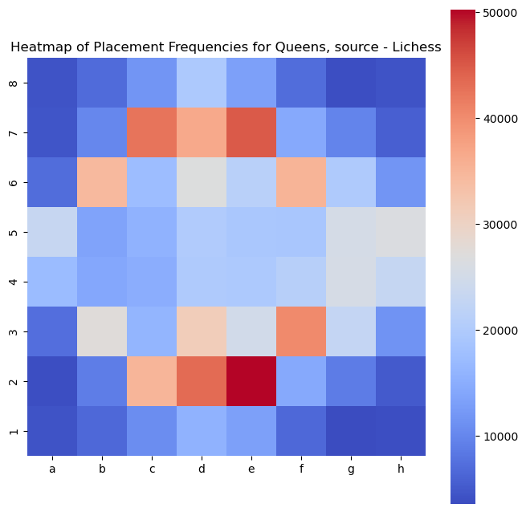
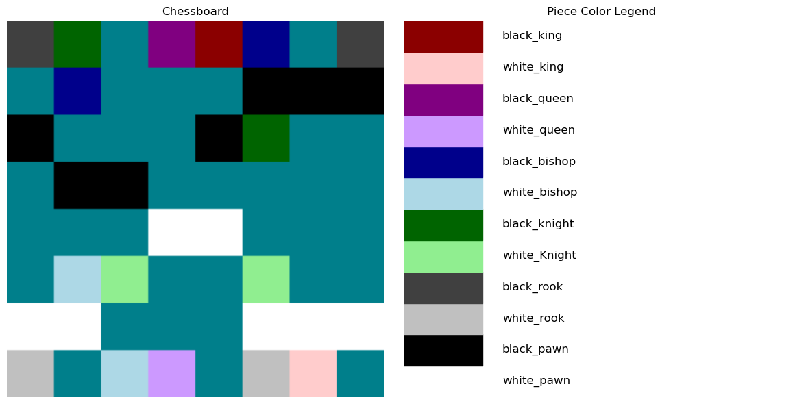
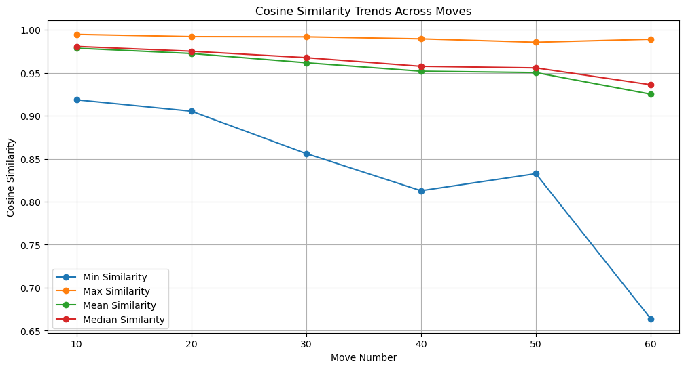

# Chess Data Analysis

This data science project explores three datasets of chess games scraped from the internet. А diverse range of tools from the Python ecosystem is used to analyze the data and uncover meaningful trends.

## Project Structure
- **`data_acquisition_and_cleaning.ipynb:`**: scraping, preparing and cleaning the data
- **`data_exploration_and_analysis.ipynb:`**: exploration and analysis

### Some Visual Results:
Heatmap of squares on which queens are most often placed:

  

The chessboard with piece position color-encoded for ResNet50 with legend:

  

Cosine similarity of color-encoded chess positions from move 10 to move 60 according to ResNet50:

  

